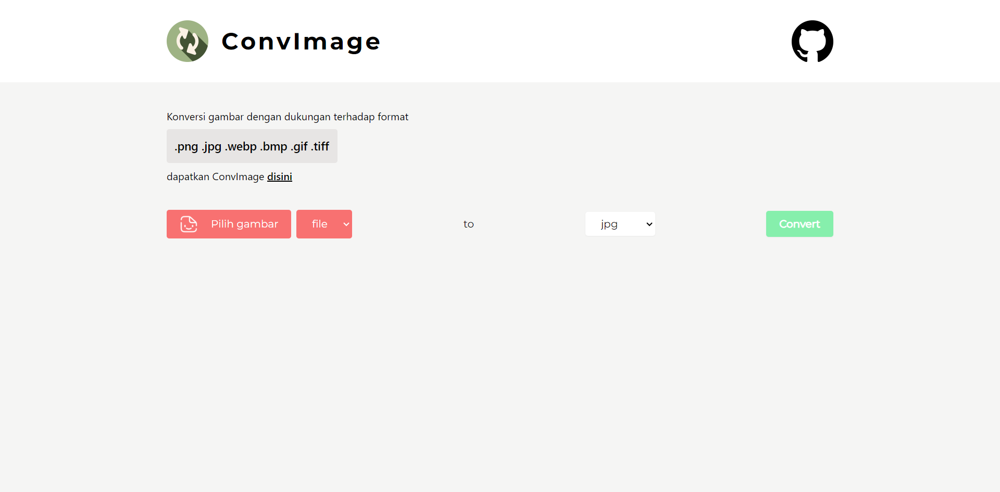

<h1 align="center"><strong>ConvImage - Konversi Gambar</strong></h1>
<p align="center"><sub>Jangan lupa tekan 🌟</sub></p>

## Langkah untuk menggunakan Setup-Express

1. ```git clone https://github.com/insanXYZ/ConvImage.git```
2. ```cd ConvImage```
3. ```npm install```
4. ```npm run start```

Konversi gambar dengan mendukung format .png .jpg .webp .bmp .gif .tiff dengan mudah, dapat juga diambil dari url.